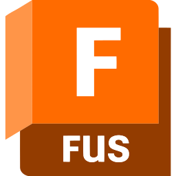

# Hi there! 👋 Welcome to my profile!

I'm a Computer Engineering undergrad passionate about programming and physics. I currently work with neutron shielding calculations at the State University of Rio de Janeiro (UERJ).

## **🌱 What I'm currently learning:**

* Software Development
* High Performance Algorithms
<table align="center">
  <tr>
    <td align="center" width="90">
      
       MySQL
    </td>
    <td align="center" width="90">
      
       Lua
    </td>
    <td align="center" width="90">
      
       Julia
    </td>
  </tr>
</table>

## **🛠️ My Main Skills:**

### Programming:

<table align="center">
<!-- skill -->
  <tr>
    <td align="center" width="90">
      
       Python
    </td>
    <td align="center" width="90">
      
       C/C++
    </td>
    <td align="center" width="90">
      
       Github
    </td>
    <td align="center" width="90">
      
       NeoVim
    </td>
  </tr>
</table>

### CAD:

<table align="center">
  <tr>
    <td align="center" width="90">
      
       SolidWorks
    </td>
    <td align="center" width="90">
      
       OnShape
    </td>
    <td align="center" width="90">
      
       Fusion360
    </td>
  </tr>
</table>

### Languages:

<table align="center">
  <tr>
    <td align="center" width="90">
      
       Portuguese
    </td>
    <td align="center" width="90">
      
       English
    </td>
  </tr>
</table>
  
## **📊 GitHub Stats:**

<table align="center">
  <tr>
    <td>
      
    </td>
    <td>
      
    </td>
  </tr>
</table>

## **📫 How to reach me:**

* Email: araujosander95@gmail.com
* [![[Your LinkedIn]](https://img.shields.io/badge/LinkedIn-[HexColor]?style=for-the-badge&logo=linkedin&logoColor=white)](https://www.linkedin.com/in/joaocelio)
* [![[Your Username]](https://img.shields.io/badge/GitHub-[HexColor]?style=for-the-badge&logo=github&logoColor=white)](https://github.com/ogcelio)

Feel free to get in touch! 😊
